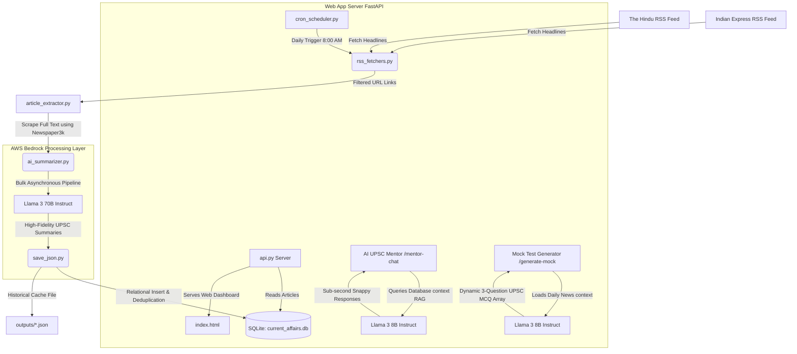

# 🚀 AI-Powered UPSC Current Affairs & Interactive Mentorship Platform

An advanced, production-grade learning and evaluation portal designed specifically for UPSC Civil Services aspirants. The platform automatically aggregates, extracts, categorizes, and summarizes daily news articles from premium national sources (*The Hindu* and *Indian Express*), mapping them directly to general studies syllabus papers (GS1, GS2, GS3, GS4) using **AWS Bedrock LLMs**. 

Additionally, it provides an interactive, RAG-enabled **UPSC AI Mentor** chatbot and a **Dynamic Mock Test Generator** to evaluate aspirants on recent news events.

---

## 🗺️ System Architecture

The diagram below outlines the flow of data, from raw national news RSS feeds, through the dual-model processing layers, and into the relational storage and interactive user portal.



---

## 📂 Project Directory Structure

Below is the structured layout of the entire codebase.

```directory
Current_affairs_using_AI/
├── .env                    # AWS Bedrock API credentials and region settings (git-ignored)
├── .gitignore              # Project-specific version control ignores
├── main.py                 # Core entry point for executing the data crawling pipeline
├── requirements.txt        # Full Python dependencies (FastAPI, uvicorn, boto3, feedparser, etc.)
├── README.md               # Extensive project architecture and execution guide
├── data/
│   └── current_affairs.db  # SQLite database storing synced articles and exam attempts
├── outputs/
│   └── current_affairs_*.json # Cached historical current affairs runs (organized by date)
└── app/
    ├── fetchers/
    │   ├── rss_fetchers.py       # RSS parsers for national newspaper feeds
    │   └── article_extractor.py   # Full-text newspaper scraper and parser
    ├── summarizer/
    │   └── ai_summarizer.py       # Parallel AWS Bedrock Llama 3 70B summarization layer
    ├── storage/
    │   ├── db_manager.py          # SQLite schema, insertions, RAG keyword searches, and purge cron
    │   └── save_json.py           # Syncs summaries to both SQLite DB and local JSON files
    ├── scheduler/
    │   └── cron_scheduler.py      # Background daily cron scheduler (APscheduler integration)
    └── ui/
        ├── index.html             # Premium glassmorphism frontend dashboard and chatbot UI
        └── api.py                 # FastAPI backend server routing, RAG controller, and model APIs
```

---

## 🧠 Dual-Model Architecture Strategy

The platform operates on a **split cognitive-load model** to optimize response quality, reduce operating costs, and eliminate user request latency:

### 1. Offline Summarization Pipeline ➡️ **Llama 3 70B** (`meta.llama3-70b-instruct-v1:0`)
* **Purpose**: Compiling daily study guides.
* **Why**: Summarizing dense, technical news articles for UPSC is highly demanding. It requires mapping stories to historical court judgments, administrative reform acts, ministries, and academic domains without introducing hallucinations. The 70B model provides superior textual reasoning and near-perfect instruction-following. Latency is not an issue since it runs in the background.

### 2. Interactive Student Features ➡️ **Llama 3 8B** (`meta.llama3-8b-instruct-v1:0`)
* **Purpose**: Powering `/mentor-chat` (AI Mentor) and `/generate-mock` (Mock Test Generator).
* **Why**: Active students require high-frequency, real-time responses. The 8B model delivers outstanding academic explanations with sub-second time-to-first-token latency. Running it separately also ensures that background summarizer pipelines **never throttle or slow down** active students!

---

## 🛠️ Codebase Walkthrough

### 1. Data Aggregation & Scrapes
* **`app/fetchers/rss_fetchers.py`**: Connects to the standard national feed sources. It parses RSS nodes, matching titles against a robust list of UPSC terms (e.g., `RBI`, `Supreme Court`, `Election`, `UN`, `Climate Change`). It filters duplicates and enforces a strict `MAX_HEADLINES` rolling buffer to keep feed processing efficient.
* **`app/fetchers/article_extractor.py`**: Takes the matched RSS URLs and performs parallel downloads. Using the `newspaper3k` engine, it cleans HTML tags, strips boilerplate advertisements, and extracts structured text, author names, and publication dates.

### 2. Core AI Summarization
* **`app/summarizer/ai_summarizer.py`**: The pipeline coordinator. It slices the compiled news list and triggers a `ThreadPoolExecutor` (configured with `max_workers=2` to protect AWS regional quotas). Each thread calls AWS Bedrock with a highly engineered system prompt instructing **Llama 3 70B** to output structured UPSC study guides (Background, Core News, Implications for Governance, Economy, S&T, and Syllabus relevance). It contains automatic retries and backoff to handle Bedrock throttling.

### 3. Database & Cache Storage
* **`app/storage/db_manager.py`**: Connects to the SQLite relational database. It maintains:
  * `articles` table: Stores summarized news with a unique constraint on titles, automatically bypassing duplicate articles.
  * `mock_history` table: Logs user exam attempts, topic scopes, and scores.
  * RAG engine (`search_articles`): Implements an alphanumeric tokenizer that ignores common English stop words to query relevant historical summaries matching any user chat query.
  * Purging Cron (`purge_old_articles`): Automatically runs after every sync, pruning historical entries older than 3 months to maintain a rolling window.
* **`app/storage/save_json.py`**: A synchronization utility that writes raw runs to `outputs/` while triggering the SQLite sync layer.

### 4. Background Scheduler
* **`app/scheduler/cron_scheduler.py`**: Uses the `apscheduler` framework to spin up a background thread. On application launch, it schedules the crawler pipeline to automatically run **daily at 8:00 AM**, ensuring students always wake up to fresh current affairs data.

### 5. Web Portal Frontend Dashboard
* **`app/ui/index.html`**: A state-of-the-art interactive user portal built using advanced Vanilla CSS.
  * **Design system**: Custom glassmorphism variables, sleek dark theme palettes, micro-interactions, responsive sizing, and elegant status notifications.
  * **Categorized News Panels**: Leverages CSS transitions to partition daily summaries into syllabus-aligned tabs (Polity, S&T, Economy, Environment, Defence, General).
  * **Interactive Chat Console**: Contains clean message bubbles, dynamic scrolling, animated loading vectors, and direct markdown parsing.
  * **Mock Exam Module**: Built-in interactive quiz deck rendering questions, options, immediate feedback, and descriptive explanations.

### 6. Backend Controller & API Server
* **`app/ui/api.py`**: Built on **FastAPI**, serving as the gateway:
  * `/latest-news` (GET): Resolves queries by returning the latest summarized batch from the database (or falling back to JSON cache files if the DB is empty).
  * `/generate-mock` (GET): Queries recent database news, structures a prompt, and uses **Llama 3 8B** to dynamically generate 3 UPSC Prelims multiple-choice questions matching real-world events.
  * `/mentor-chat` (POST): Processes student academic queries. It runs a RAG query over the SQLite database to fetch relevant current affairs context, compiles a prompt, and generates a structured guide using **Llama 3 8B**.

---

## 🔌 API Documentation

| Endpoint | Method | Params | Description |
| :--- | :--- | :--- | :--- |
| `/` | `GET` | *None* | Serves the premium interactive frontend dashboard (`index.html`). |
| `/latest-news` | `GET` | *None* | Returns the latest daily batch of categorized and summarized articles. |
| `/generate-mock` | `GET` | `topic: str`, `week_offset: int` | Dynamically returns a 3-question UPSC MCQ quiz generated by the AI from recent articles. |
| `/mentor-chat` | `POST` | `JSON body: { "message": "query" }` | RAG-enabled endpoint returning structured academic mentorship guides from the AI Mentor. |

---

## 🛠️ Step-by-Step Installation & Setup

Follow these commands to deploy the application locally on your Windows machine:

### 1. Clone the Codebase
Place the project files inside your preferred workspace directory:
```powershell
# Navigate to your workspace directory
cd "C:\Users\raghv\OneDrive\Desktop\Current_affairs_using_AI"
```

### 2. Set Up a Python Virtual Environment
Initialize a clean environment using Python 3:
```powershell
# Create virtual environment
python -m venv venv

# Activate virtual environment on Windows
.\venv\Scripts\Activate.ps1
```

### 3. Install Dependencies
Install all required packages from `requirements.txt`:
```powershell
pip install -r requirements.txt
```

### 4. Configure Environment Credentials (`.env`)
Create a `.env` file in the root directory to store your AWS Bedrock access keys:
```env
AWS_ACCESS_KEY_ID="YOUR_AWS_ACCESS_KEY"
AWS_SECRET_ACCESS_KEY="YOUR_AWS_SECRET_KEY"
AWS_REGION="ap-south-1"
```

### 5. Initialize the SQLite Database & Run the Crawler
Execute the main script to fetch historical articles, summarize them using Bedrock Llama 3 70B, and sync them with your database:
```powershell
# Enable UTF-8 mode to print emojis and unicode content without encoding crashes on Windows
$env:PYTHONUTF8=1
$env:PYTHONIOENCODING="utf-8"

# Run the pipeline
python main.py
```

### 6. Run the FastAPI Web Application
Start the uvicorn web server in reload mode (the server will automatically watch for file modifications and reload without shutting down):
```powershell
# Run the server
$env:PYTHONUTF8=1
$env:PYTHONIOENCODING="utf-8"
python -m uvicorn app.ui.api:app --host 127.0.0.1 --port 8000 --reload
```

---

## 💻 Web App Operation & Features

Once uvicorn starts successfully, open your browser and navigate to:
👉 **[http://127.0.0.1:8000/](http://127.0.0.1:8000/)**

### 🎨 The Interface

````carousel
```markdown
* Visual Category Tabs: Switch between Polity, Economy, S&T, Environment, and Defence to browse UPSC summaries.
* Daily News Cards: Read comprehensive "Background", "Why it Matters", and "Future Implications" for each article.
```
<!-- slide -->
```markdown
* AI UPSC Mentor Chatbot: Type questions like "What is basic structure?" or "Explain the Governor's discretionary powers".
* RAG-Enabled Answers: The chatbot automatically queries your database to incorporate recent news into its explanation.
```
<!-- slide -->
```markdown
* Dynamic Quiz Module: Solve multiple-choice questions matching real-world events.
* Immediate Academic Feedback: Get immediate answer evaluations along with comprehensive explanations.
```
````

---

## ⚖️ License & Contributing

* **Licensing**: Open-source under the MIT License.
* **Contributions**: Pull requests are welcome! For major feature updates, please open an issue first to discuss your design proposal.
